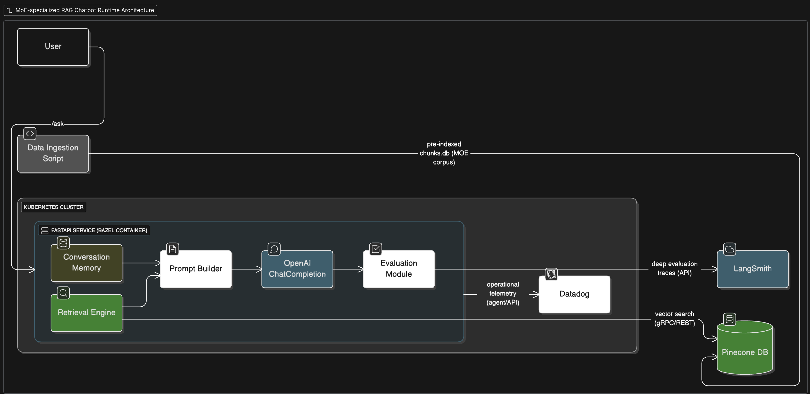

# MoE-Specialized RAG Chatbot

> **A Kubernetes-ready FastAPI micro-service that answers Mixture-of-Experts (MoE) questions with a modern, optimized Retrieval-Augmented Generation (RAG) stack.**  
> Features hybrid Pinecone retrieval, multi-turn memory, reference-free online evaluation with LangSmith, and operational telemetry in Datadog.

---

## 📐 Architecture



<sub>All components run locally in a kind/minikube cluster; external SaaS services remain in the cloud.</sub>

---

## ⚙️ Tech Stack

| Layer | Technology |
|-------|------------|
| API & Web | **Python 3.12**, **FastAPI**, **Pydantic v2** |
| Retrieval | **Pinecone** (hybrid vector + BM25, MMR diversification) |
| LLM | **OpenAI** – `text-embedding-3-small`, `chat.completions` |
| Build / Image | **Bazel** (`rules_python`, `rules_docker`) |
| Runtime | **Kubernetes** (kind/minikube) |
| Memory | In-process deque (swappable to Redis) |
| Evaluation | **LangSmith** — LLM-judge metrics, deep traces |
| Telemetry | **Datadog** — latency, token counts, chunk IDs |
| CI/CD | **GitHub Actions** — Bazel test ➜ build |

---

## 🚀 Quick Start (Local)

### 1. Prerequisites

| Tool | Version |
|------|---------|
| Docker | 24+ |
| kind **or** minikube | latest |
| Bazelisk | 1.19+ |
| Python | 3.12 |

### 2. Clone + Env Vars

```bash
git clone <your-fork-url>
cd <repo>
cp .env.template .env          # fill API keys
